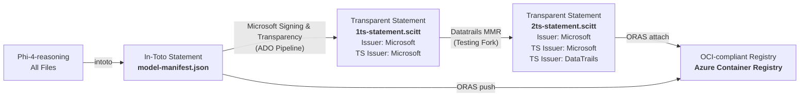

# scitt-for-phi

This repo contains sample files illustrating the steps involved in making a [SCITT](https://ietf-wg-scitt.github.io/draft-ietf-scitt-architecture/draft-ietf-scitt-architecture.html) Signed Statement for a reasoning model ([Phi-4-Reasoning](https://huggingface.co/microsoft/Phi-4-reasoning)), committing it to multiple SCITT Transparency Services, and verifying the resulting SCITT Transparent Statement.

Definitions for Capitalised Terms used above can be found in the [terminology section](https://ietf-wg-scitt.github.io/draft-ietf-scitt-architecture/draft-ietf-scitt-architecture.html#name-terminology) of the Architecture [document](https://ietf-wg-scitt.github.io/draft-ietf-scitt-architecture/draft-ietf-scitt-architecture.html).



# Install demo package

Create a virtual environment, and update the project's environment.

```
  $ uv venv
  $ source .venv/bin/activate
  $ uv sync
```

# Re-creating the Model Manifest

## Download Phi-4-reasoning

From [Huggingface](https://huggingface.co/microsoft/Phi-4-reasoning/tree/main)

```
  $ huggingface-cli download microsoft/Phi-4-Reasoning --revision 57faa5302213dfe4155297bb19f66d2959d0b137
```

Model is downloaded to `$HOME/.cache/huggingface/hub/models--microsoft--Phi-4-Reasoning/snapshots/57faa5302213dfe4155297bb19f66d2959d0b137/`.

## Produce the Model Manifest (In-Toto Statement format)

This is the same [format](https://github.com/sigstore/model-transparency/blob/main/docs/model_signing_format.md) used by [sigstore/model-transparency](https://github.com/sigstore/model-transparency/).

```
  $ intoto $HOME/.cache/huggingface/hub/models--microsoft--Phi-4-Reasoning/snapshots/57faa5302213dfe4155297bb19f66d2959d0b137/ > in-toto-model-manifest.json
```

Sample output is checked-in under `model-manifest.json`.

# Issuing Transparent Statements

## Submitting the Model Manifest to the Microsoft internal transparent signing service as a payload

This is done outside of this repo, in an ADO pipeline. The resulting Transparent Statement is saved  as `1ts-statement.scitt`.

## Adding Datatrails/MMR receipt to Transparent Statement

```
$ staple_receipt 1ts-statement.scitt datatrails-mmr.receipt > 2ts-statement.scitt
```

# Verifying Transparent Statements

Run verification script, either for the combined statement:

```
$ verify 2ts-statement.scitt
Found receipt using profile: CCF (2)
Verified receipt from issuer (1): esrp-cts-cp.confidential-ledger.azure.com, subject (2): scitt.ccf.signature.v1
Found receipt using profile: MMR (3)
Verified receipt from issuer (1): https://github.com/robinbryce/veracity, subject (2): fork-768-782.bin
Verified transparency of statement: 2ts-statement.scitt
```

or Microsoft signing & transparency only:

```
$ verify 1ts-statement.scitt 
Found receipt using profile: CCF (2)
Verified receipt from issuer (1): esrp-cts-cp.confidential-ledger.azure.com, subject (2): scitt.ccf.signature.v1
Verified transparency of statement: 1ts-statement.scitt
```

# Publishing the Model Manifest and Transparent Statement to Azure Container Registry

In the `acr` directory, run `log_in_and_upload_to_acr.sh`.
Alternatively, log into the target ACR, run `source acr_env`, and run the following commands:

```
# Upload the In-Toto Statement to ACR
$ oras push $IMAGE --artifact-type in-toto/model-manifest ../model-manifest.json:application/vnd.in-toto+json
# Attach the SCIT Transparent Statement
$ oras attach $IMAGE --artifact-type scitt/transparent-statement ../2ts-statement.scitt:application/scitt-statement+cose
```

The manifest can now be discovered either in the Azure Portal, or via:

```
$ oras manifest fetch --pretty $IMAGE
{
  "schemaVersion": 2,
  "mediaType": "application/vnd.oci.image.manifest.v1+json",
  "artifactType": "in-toto/model-manifest",
  "config": {
    "mediaType": "application/vnd.oci.empty.v1+json",
    "digest": "sha256:44136fa355b3678a1146ad16f7e8649e94fb4fc21fe77e8310c060f61caaff8a",
    "size": 2,
    "data": "e30="
  },
  "layers": [
    {
      "mediaType": "application/vnd.in-toto+json",
      "digest": "sha256:372ddde5ddb6abbcc3246a90ba7e7a24cfa2bed12b7878991cca2098aadcba69",
      "size": 4518,
      "annotations": {
        "org.opencontainers.image.title": "../model-manifest.json"
      }
    }
  ],
  "annotations": {
    "org.opencontainers.image.created": "2025-07-15T09:13:25Z"
  }
}
```

And the attached SCITT Signed Statement via:

```
$ oras discover --format tree $IMAGE
xraydemo-bnasgxcyhkbfahfu.azurecr.io/scitt-for-phi@sha256:eae494a87d3839e739489850f6542773d8db52d8f567556529deeecf6e48d7ce
└── scitt/transparent-statement
    └── sha256:636db14f13dcef763d58742eea6a313a84f2b5535834b22124a38e40d86445ec
```

Artifact Management [reference link](https://learn.microsoft.com/en-us/azure/container-registry/container-registry-manage-artifact).


# Printing contents of a transparent statement

```
$ print_cose 2ts-statement.scitt
...
```